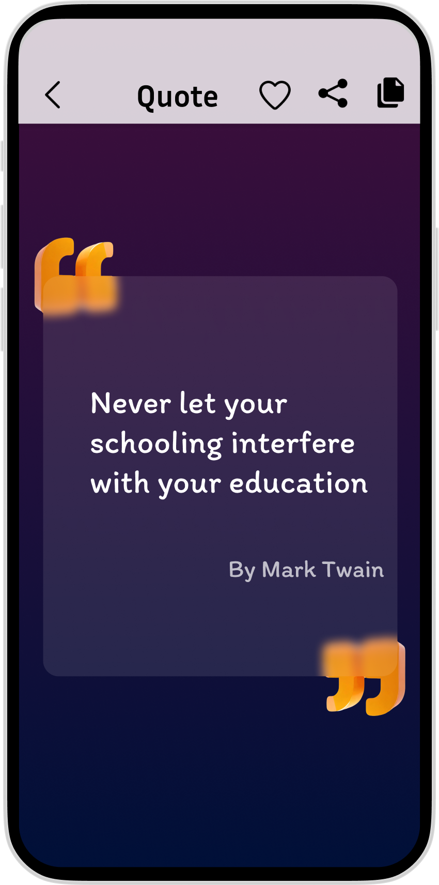
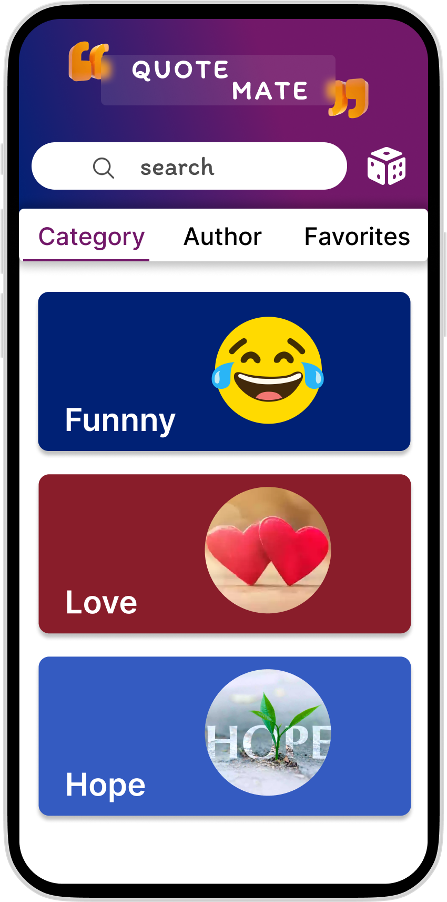
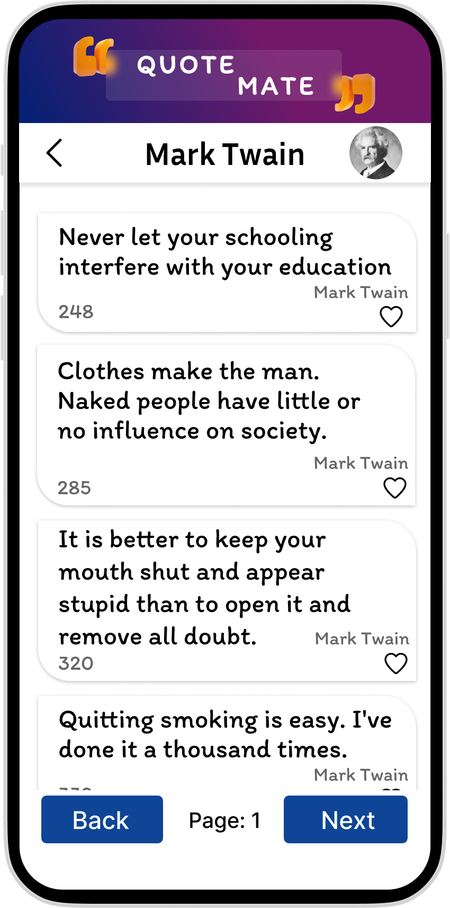
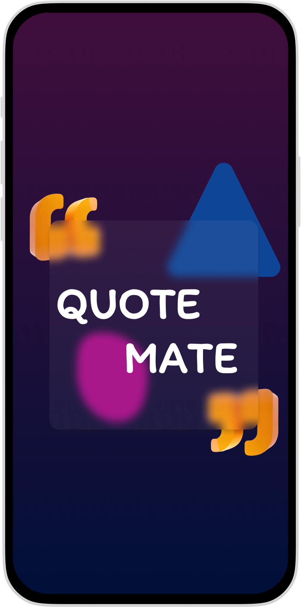

# QUOTEMATE

QuoteMate - Elevate your inspiration with thousands of ever-refreshing quotes in a beautifully designed app. Discover daily wisdom, save your favorites, and share moments of inspiration with a touch of elegance.

## Features

- **Thousands of Quotes**: Explore a vast collection of inspirational, motivational, and thought-provoking quotes.

- **Continuous Updates**: We're constantly adding new quotes to keep you inspired and engaged.

- **Beautiful Design**: Our app offers a stunning and elegant design to enhance your reading experience.

- **Search and Categorization**: Easily find quotes by keyword or browse them by categories.

- **Favorites**: Mark quotes as favorites to revisit them later.

- **Share and Save**: Share your favorite quotes with friends or save them for future reference.
-     

## Getting Started

Just Clone in your favorite android development IDE and build. 

## Usage

Build in your favorite IDE and install the APK. 

## Contributing

We welcome contributions from the open-source community to make this app even better. If you'd like to contribute, please follow these steps:

1. Fork the repository.
2. Create a new branch for your feature or bug fix.
3. Make your changes and submit a pull request.

## Issues

If you encounter any issues with the app, please open a new issue on this GitHub repository. We appreciate your feedback and will work to resolve the problem.

## License

## Contact

tanishsempala3@gmail.com

